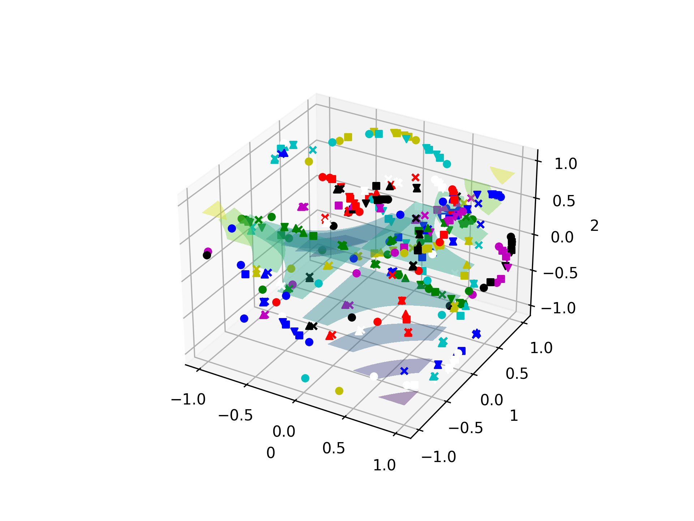
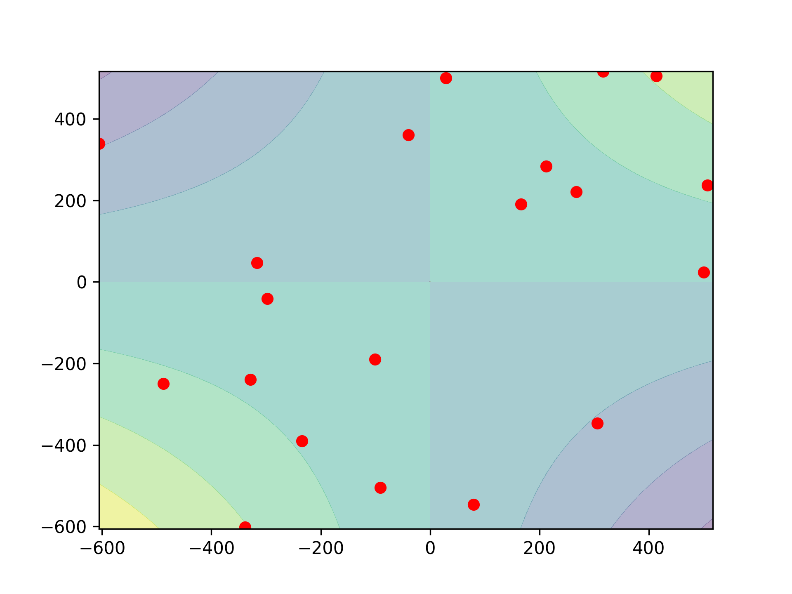
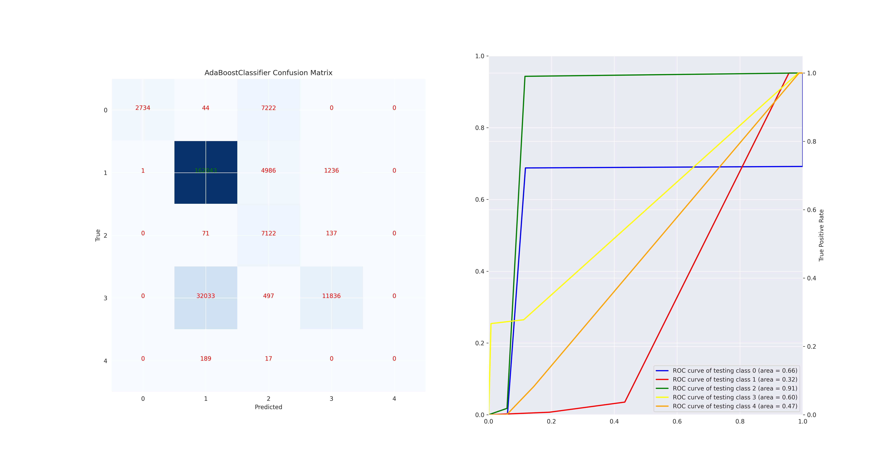
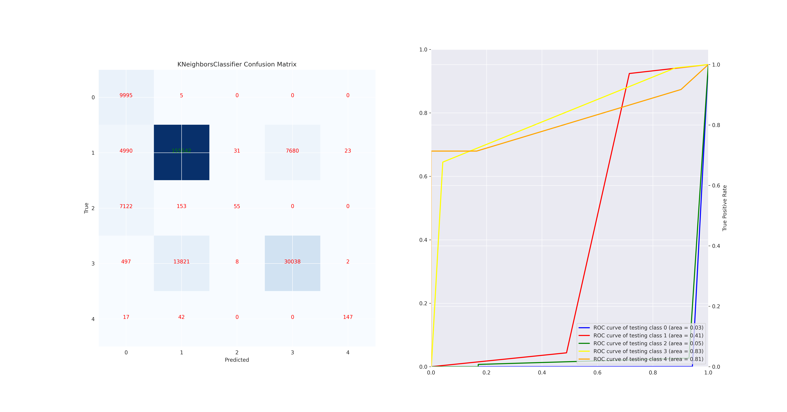
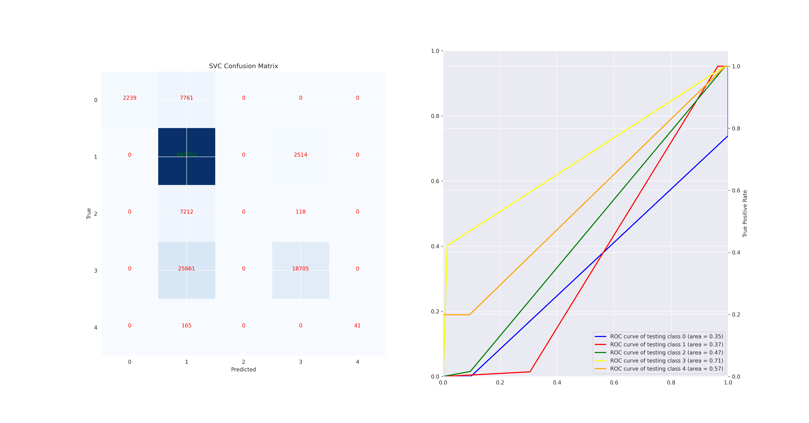
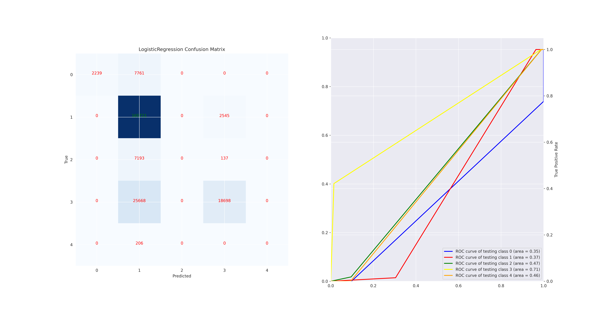
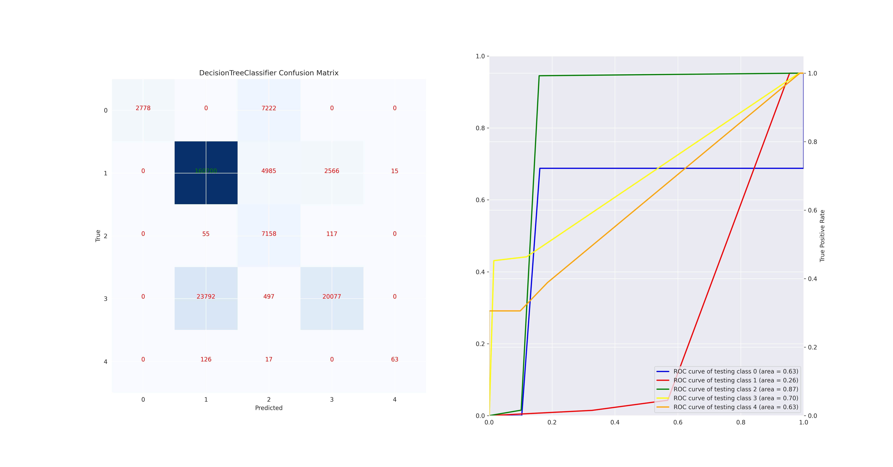
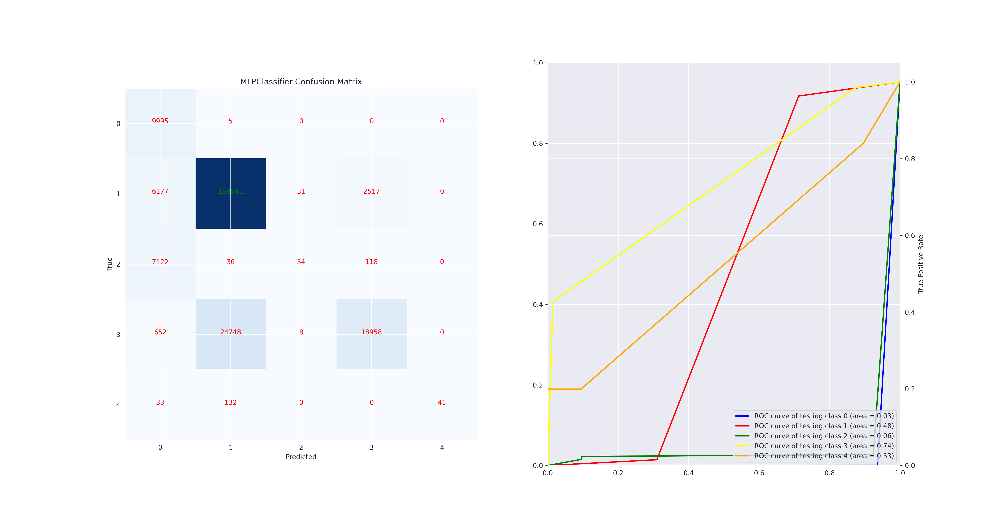

##elfwalker 

usage:  
#step 1 

Before starting, make sure you turned off limits and file handle limitations from the system. use 
``` 
 ulimit -eH 

```

and modify accordingly, we recommend 1M at least.
 
Preparing the classes for classification : 

To crawl over all the installed packages and collect the files associated with the packages use:

```
python3 dpkg_enumerator.py 

```
It will first enumerate the packages and save to a json file.
Then it will create a job for each package to collect its installed files 


#step 2  

The next step is to categorize the files. Labels and categories are extracted from the description and associated to the files 
of the package prior to the symbol extraction process :

```
python3 package_analyzer.py

```

This part  will also run in parallel from the enumerator, but a very strong machine is needed with dpkg cpu and memory resource consumption.

The output for each package once the job is done will be printed to the console (full sequence and results) for instance for package libv4lconvert it will be :

```
{'sequence': "{'Status': 'install ok installed', 'Priority': 'optional', 'Section': 'libs', 'Installed-Size': '304', 'Maintainer': 'Ubuntu Developers <ubuntu-devel-discuss@lists.ubuntu.com>', 'Architecture': 'amd64', 'Multi-Arch': 'same', 'Source': 'v4l-utils', 'Version': '1.22.1-2build1', 'Replaces': 'libv4l-0 (<< 0.8.5-4)', 'Depends': 'libc6 (>= 2.34), libjpeg8 (>= 8c)', 'Breaks': 'libv4l-0 (<< 0.8.5-4)', 'Description': 'Video4linux frame format conversion library', 'libv4lconvert offers functions to convert from any (known) pixelformat': 'libv4lconvert offers functions to convert from any (known) pixelformat', 'to BGR24, RGB24, YUV420 and YVU420.': 'to BGR24, RGB24, YUV420 and YVU420.', 'This package contains the shared library.': 'This package contains the shared library.', 'Homepage': 'https://linuxtv.org/downloads/v4l-utils/', 'Original-Maintainer': 'Gregor Jasny <gjasny@googlemail.com>', 'package name': 'libv4lconvert0'}", 'labels': ['library', 'media', 'development', 'system', 'resources', 'service', 'network', 'utility', 'miscellaneous', 'graphics', 'kernel', 'database', 'security'], 'scores': [0.28513965010643005, 0.1326003074645996, 0.1318744271993637, 0.08926698565483093, 0.0799623429775238, 0.06678170710802078, 0.047244634479284286, 0.039674509316682816, 0.03900154307484627, 0.03281520679593086, 0.019844291731715202, 0.018736472353339195, 0.01705796644091606]}

```

Once all the jobs are done, the aggregated results will be normalized , vectorized and flattented to 2D columns and rows and saved to a dataset.

This will be used in the next step as a generalized dataset and corpus for inference of known categories of resource files starting with elf formats.


#step 3

package_elf_analyzer.py will iterate over the package_files json  and perform the following steps:

enumerate the package's files, extract the symbols and add them to the dataset with correlation to the package classification for each category(label)

The association of the symbol table and the package classification will be added to the dataset and saved to a csv file

Basically, this provides enough data for efficient symbol table association. 

Additionally, we can parse the data section code and add it to the dataset.


#step 4


create a directory for the datasets (i.e. usrbin for /usr/bin or sbin or locallib64 for /usr/local/lib64 ,etc... )


run the elfwalker from the newly created directory,for instance for sbin: 
```
python3 ../elfwalker.py /sbin 
```


The output will be verbose per section and symbol extracted. 
 

 
Additionaly, a meta-parameter dataset is created from the elf parameters 


Once it's done, two diagrams will display, one denoting general distribution of the samples and features, the second is a t-sne plot focusing on the label association.


 and 

#step 2

This step will simply analyze the text symbols and the discrete value columns using tfidf and label encoder 

```
python3 ../analyze_symbols.py 
```


once it finished it will print out the rows/columns and summary of the original textual dataset. 

#step 3 

Finally, run :
```
python3 ../draw_processed_symbols.py 

```


It will attempt to classify the vectorized symbols dataset and generate an image for each classifier and a text file with metrics and results (confusion matrix,auc/roc curve/etc...).

Examples:








 


Yaniv [a.k.a. shokoluv] Karta


